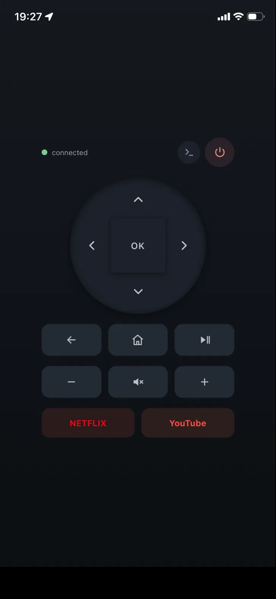
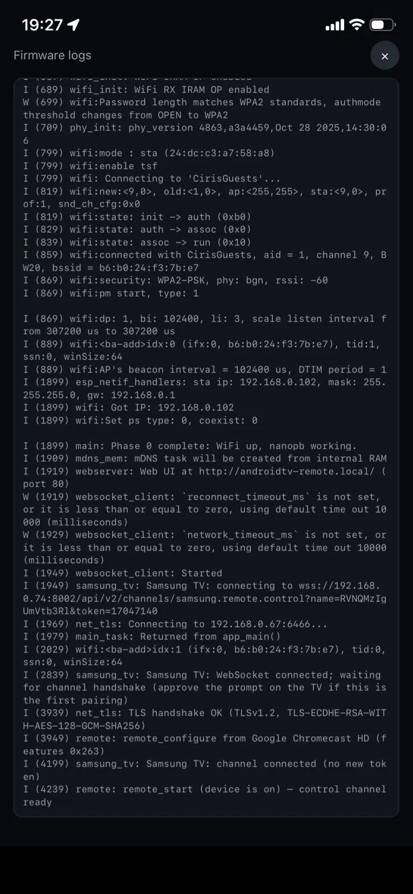

# ESP32 Android TV Remote

Firmware that turns a ~$5 ESP32 dev board into a WiFi remote control for a
Chromecast with Google TV (or any Android TV device speaking the **Android TV
Remote protocol v2** — the same protocol the Google TV phone app uses). The
ESP32 keeps a paired, encrypted session with the TV and serves a modern,
phone-friendly web remote to every device on your LAN. No cloud, no app
install, no soldering.

**Features**

- One-time pairing with the TV's on-screen code, done entirely from the web UI
- D-pad, OK, back, home, play/pause, power; press-and-hold auto-repeat
- Netflix / YouTube launch buttons (app deep links)
- Reachable at `http://androidtv-remote.local/` via mDNS
- Installable as a **Progressive Web App** — add it to your phone's home
  screen and it opens full-screen, like a native remote app (see
  [Install as an app](#install-as-an-app-pwa) below)
- Auto-reconnects through WiFi blips, TV reboots, and power loss — pairing
  survives everything short of deleting the certificate

## Screenshots

<p align="center">
  
  
</p>

---

## Quick start

Hardware: an ESP32 dev board (tested: DOIT ESP32 DevKit v1 / WROOM-32) and a
Chromecast with Google TV on the same WiFi network.
Software: [PlatformIO Core](https://platformio.org/install/cli) and `openssl`.

```sh
git clone <this repo> && cd esp32-androidtv

# 1. Generate the client certificate (once — the TV's trust binds to it)
./tools/gen_cert.sh

# 2. Configure WiFi credentials and the TV's IP address
pio run -t menuconfig          # menu: "Android TV Remote"

# 3. Build and flash (board plugged in via USB)
pio run -t upload

# 4. Pair: open the web UI from any device on the same WiFi
#    http://androidtv-remote.local/  (or the IP printed on serial)
#    The TV shows a 6-character code -> type it into the page -> done.
```

That's it. The remote reconnects automatically on every boot from then on.

> If your board uses a different module, change `board = esp32doit-devkit-v1`
> in `platformio.ini` (any 4 MB-flash ESP32 works; ESP8266 does not — not
> enough RAM for mutual TLS).

---

## Install as an app (PWA)

The web UI ships a PWA manifest and icons, so it installs like a native app
instead of living as a browser tab — worth doing, since it opens full-screen
with no address bar, gets its own home-screen icon, and launches straight
into the remote.

- **iOS (Safari):** open `http://androidtv-remote.local/`, tap the **Share**
  icon, then **Add to Home Screen**.
- **Android (Chrome):** open the page, tap the **⋮** menu, then **Add to Home
  screen** / **Install app** (Chrome may also prompt automatically).

Once installed, it behaves like any other app on the phone — no browser
chrome, and it reconnects to the ESP32 on launch the same way the page does.

---

## How it works

Three connections, two protocols:

| Leg | Transport | Purpose |
|-----|-----------|---------|
| ESP32 → TV `:6467` | mutual TLS, protobuf | one-time pairing (trust setup) |
| ESP32 → TV `:6466` | mutual TLS, protobuf | control: keys, app links, keepalive |
| browser → ESP32 `:80` | plain HTTP | the web remote UI + JSON API |

The TV-facing legs re-implement
[`tronikos/androidtvremote2`](https://github.com/tronikos/androidtvremote2)
in C: length-delimited protobuf frames (nanopb) over mbedTLS, presenting a
self-signed RSA-2048 client certificate. During pairing the TV shows a code;
the firmware proves knowledge of it by hashing both certificates' RSA key
material with the code's nonce (SHA-256). After the TV acknowledges, it
trusts that certificate forever — future sessions skip pairing.

The browser leg is deliberately plain HTTP with no auth: same trust model as
any home IoT admin page. Don't port-forward it to the internet.

Only one FreeRTOS task (`tv_session`) ever touches the TLS socket. HTTP
handlers drop commands into queues; the session task drains them, paced at
50 ms per key (the TV closes the session if keys arrive faster than a human
remote could send them).

## HTTP API

| Endpoint | Method | Body / Response |
|----------|--------|-----------------|
| `/` | GET | the remote UI |
| `/api/status` | GET | `{"paired":bool,"connected":bool,"state":str,"volume":{level,max,muted}}` |
| `/api/pair` | POST | `{"code":"A1B2C3"}` → `{"ok":bool}` (only valid in `wait_code` state) |
| `/api/key` | POST | `{"key":"DPAD_UP","direction":"SHORT"}` — any name from the `RemoteKeyCode` enum, `KEYCODE_` prefix optional; direction `SHORT` (default) / `START_LONG` / `END_LONG` |
| `/api/app` | POST | `{"link":"netflix://home"}` — app deep link |

`state` values: `boot`, `pairing`, `wait_code`, `pair_failed`, `paired`
(control channel down/reconnecting), `connected`.

## Repo layout

```
main/               firmware sources (one .c/.h per subsystem)
  net_tls.*         mutual-TLS client (mbedTLS)
  proto_frame.*     varint length-delimited framing (transport-agnostic)
  pairing.*         pairing state machine + secret computation
  remote.*          control channel: configure, keepalive, keys, app links
  webserver.*       esp_http_server routes + mDNS
  app_state.*       shared status struct + command queues
  store.*           NVS persistence (paired flag)
  proto_gen/        GENERATED nanopb code — never edit by hand
components/nanopb/  vendored nanopb 0.4.9.1 runtime
proto/              .proto files (verbatim from the reference) + nanopb .options
web/index.html      the whole web UI (inline CSS/JS), embedded into firmware
certs/              client cert/key (gitignored — generate with tools/gen_cert.sh)
test/               host unit tests + golden-byte generators
tools/              gen_cert.sh, gen_proto.sh, test_host.sh
```

## Development

```sh
pio run                  # build
pio run -t upload        # flash
pio run -t monitor       # serial log, 115200 baud
./tools/test_host.sh     # host-side unit tests (framing vs. golden bytes)
```

- **Protos changed?** `pip install nanopb==0.4.9.1`, then `./tools/gen_proto.sh`
  (generator version must match `components/nanopb/`).
- **Golden test vectors**: `test/gen_golden.py` (framing) and
  `test/gen_pairing_oracle.py` (pairing secret) generate the `.inc` files from
  the reference implementation. The pairing oracle is derived from *your*
  client cert — rerun it if the cert is ever regenerated.
- **Web UI changes** live in `web/index.html` and are embedded at build time —
  edit, `pio run -t upload`, refresh the page (it's served `no-store`, so no
  cache tricks needed).
- `CLAUDE.md` records protocol ground truth and hard-won device quirks — read
  it before touching pairing, keepalive, or key-direction logic.

## Releases

PR titles (and thus squash-merge commit messages on `main`) must follow
[Conventional Commits](https://www.conventionalcommits.org/) — e.g. `feat:
add IR blaster support`, `fix: reconnect backoff overflow`. A GitHub Action
([`pr-title.yml`](.github/workflows/pr-title.yml)) blocks merging otherwise.

On every push to `main`, [`release.yml`](.github/workflows/release.yml) runs
[semantic-release](https://semantic-release.gitbook.io/): it reads commits
since the last tag, decides whether a release is warranted (`fix:` → patch,
`feat:` → minor, `BREAKING CHANGE:` in the body → major), bumps
`main/version.h` and `CHANGELOG.md`, and publishes a tag + GitHub Release.
Nothing to run by hand — just write conventional commit messages.

## Adding app shortcut buttons

The Netflix/YouTube buttons are just app **deep links** sent through
`RemoteAppLinkLaunchRequest` — adding another app is a small edit to
`web/index.html`.

**1. Find a link that works.** Test candidates live against your TV without
touching the firmware:

```sh
curl -X POST http://androidtv-remote.local/api/app \
     -H 'Content-Type: application/json' \
     -d '{"link":"https://www.disneyplus.com"}'
```

Known-working examples (may vary by app version):

| App | Link |
|-----|------|
| YouTube | `https://www.youtube.com/tv` |
| Netflix | `netflix://home` |
| Disney+ | `https://www.disneyplus.com` |
| Prime Video | `https://app.primevideo.com` |
| Spotify | `spotify://` |
| YouTube Music | `https://music.youtube.com` |

Many apps accept their website URL as a deep link. If nothing happens on the
TV, search "<app name> android tv deep link" — anything the app registers as
an Android intent filter works.

**2. Add the button** in the `#apps` grid in `web/index.html`:

```html
<button id="app-disney" data-link="https://www.disneyplus.com">Disney+</button>
```

The `data-link` attribute is all the wiring there is — every `[data-link]`
button POSTs to `/api/app` automatically. Optionally add a brand color in the
CSS next to the existing entries:

```css
#app-disney { background: #16213a; color: #6ab5f8; }
```

With three or more apps, consider `#apps { grid-template-columns: repeat(3, 1fr); }`.

**3. Reflash** (`pio run -t upload`) and refresh the page — the UI is
embedded in the firmware. Links longer than 127 characters are rejected
(`APP_LINK_MAX` in `main/app_state.h`).

## Device quirks (learned the hard way)

- **Volume/mute don't work on Chromecast HD — and can't.** The device
  delegates volume to the TV over HDMI-CEC and reports `volume_max: 0`; its
  physical remote uses an IR blaster. The reference Python library can't
  change volume either. The UI greys the volume buttons when it sees
  `max: 0`.
- **The TV closes the session on rapid long-press pairs.** Taps must be sent
  as `SHORT`; the `START_LONG`/`END_LONG` pair is reserved for real holds
  (the UI uses a 300 ms threshold).
- **Keys must be paced.** Queued keys go out 50 ms apart; back-to-back writes
  make the TV drop the connection.
- **The TV doesn't ping reliably.** After 10 s of silence the firmware sends
  its own ping probe and reconnects only if it goes unanswered — a fixed
  idle-disconnect kills healthy sessions.

## Troubleshooting

- **Upload fails with "No serial data received"** — the CH340 on DOIT boards
  can't handle high baud; `upload_speed = 115200` is already set, but check
  your cable (must be data-capable).
- **Device bootloops after adding an HTTP route** — `max_uri_handlers` (12)
  is full; raise it in `webserver.c`.
- **Web page unreachable but serial says connected** — check that your
  browser device and the ESP32 are on the *same* SSID; guest networks often
  isolate clients from other networks (this cost us an evening).
- **TV shows no pairing code** — make sure the Chromecast is awake, and that
  `ATV_TV_IP` (menuconfig) matches its current IP; a DHCP change moves it.
- **Re-pairing needed** (TV factory reset, etc.): on the TV, remove old
  paired devices under Settings → Remotes & Accessories if present; then
  erase the ESP32's paired flag with `pio run -t erase` + reflash (NVS is
  wiped), or clear just NVS. Keep `certs/` — regenerate only if you also
  intend to re-pair.
- **First build on Arch/Python 3.14** — the espressif32 builder pins
  `pydantic<2.12`, which can't build on 3.14. Install
  `idf-component-manager`, `esp-idf-kconfig`, and `pydantic>=2.12` into
  `~/.platformio/penv/.espidf-*/` manually and create
  `~/.platformio/packages/framework-espidf/.pio_skip_pypackages` (details in
  `PLAN.md` §0).

## Security model

The client key in `certs/` is the device's identity — anyone holding it (and
LAN access) can control your TV. It's gitignored; keep it that way. The web
UI is unauthenticated by design and must stay LAN-only.
